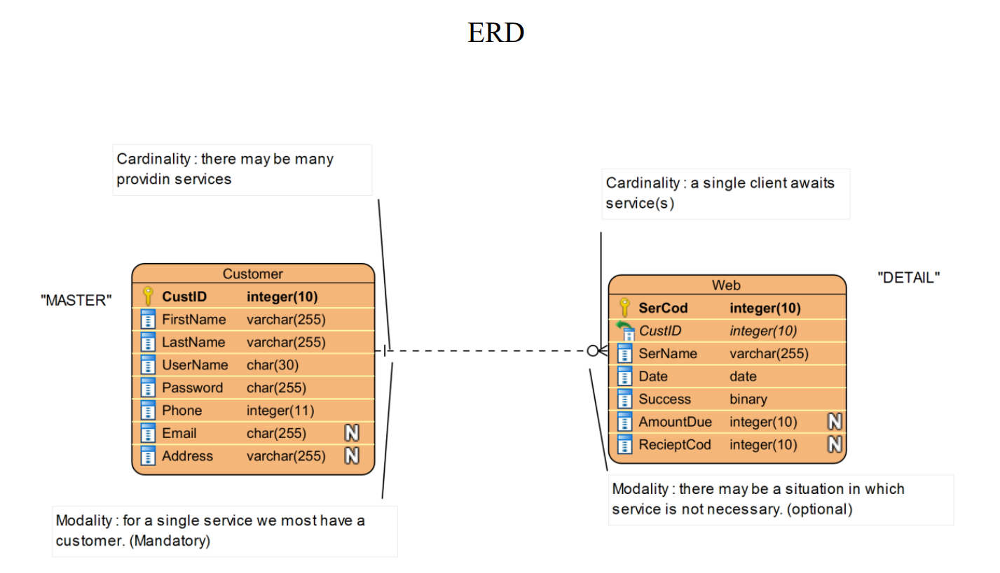
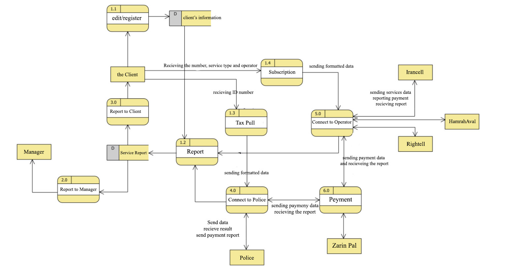

# Static Website - Personal Coding Showcase

This is a simple, static website created to demonstrate my skills in HTML and CSS. The project includes a homepage and a couple of service pages, along with a Sign-Up and Login page for user authentication. It showcases basic web features such as navigation, forms, and layout design. 

## Pages

### 1. `index.html` - Main Page
- **Features**: Navbar, Search bar, Service sections with clickable cards, Footer.
- **Languages**: HTML, CSS (via external stylesheet).

### 2. `m1.html` - Service Page 1 (Car Services)
- **Features**: Form to enter car information for checking fines and fees.
- **Languages**: HTML, CSS.

### 3. `m2.html` - Service Page 2 (Simcard Services)
- **Features**: Form to select a mobile operator and choose between recharge or data packages.
- **Languages**: HTML, CSS.

### 4. `login.html` - Login Page
- **Features**: Form to log in using **Username** or **Email** and **Password**.
- **Languages**: HTML, CSS.

### 5. `signup.html` - Sign-Up Page
- **Features**: Form to sign up by entering details such as **Name**, **Username**, **Password**, **Phone Number**, **Email**, and **Address**.
- **Languages**: HTML, CSS.

## Styles
The project uses an external CSS file (`style.css`) to define the layout, colors, and responsiveness for different screen sizes.

### Features:
- **Responsive Design**: The website layout adapts to different screen sizes, with a dropdown menu for mobile devices.
- **Form Handling**: Simple forms for user input (car info, sim card recharge, sign-up, and login).
- **Interactive Elements**: Links to navigate between pages.

## How to Run
1. Clone the repository or download the files.
2. Open the `index.html` in any web browser.

## Tech Used
- HTML5
- CSS3

## ERD (Entity Relationship Diagram)
I have worked on this diagram to illustrate how the system operates in reality and how it can be integrated with a database and APIs. The ERD showcases the relationships between users, services, and transactions.

  <!-- Replace with your ERD image file -->

## DFD (Data Flow Diagram)
I have created the following DFDs to visualize the data flow within the system and how it connects with external components like databases and APIs.

### Level 0
Here is the DFD Level 0, which provides an overview of the data flow in the system.

  <!-- Replace with your DFD Level 0 image file -->

### Level 1
The DFD Level 1 shows the detailed flow of data within the main modules of the website: Banking, Telecommunications, and Police Services.

  <!-- Replace with your DFD Level 1 image file -->

## Glossary
- **Clients**: The individuals who use the services provided by the website. They can register, log in, and use the services.
- **Services**: The different offerings available on the website, including banking, telecommunication, and police services.
- **Transactions**: The actions where users perform payments, recharge, or pay fines.

## License
Feel free to use or modify this code.
